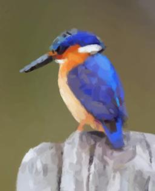
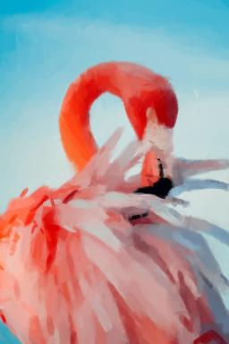
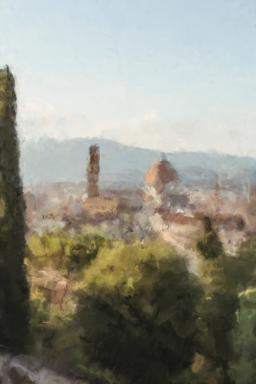
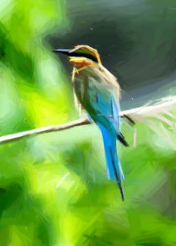
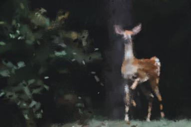
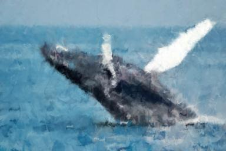
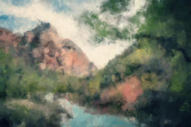
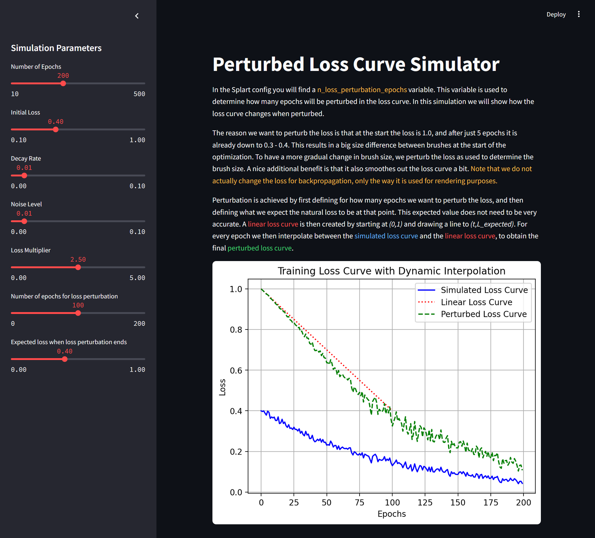
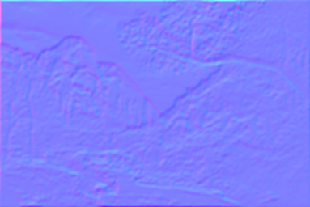

# Splart: Differentiable Painting

**The related blogpost can be found [HERE!](https://www.berryvansomeren.com/posts/splart) ✨**

Splart is an alternative approach to the ideas of [Drarwing](https://github.com/berryvansomeren/drarwing_web).
Instead of the genetic algorithm drarwing uses, 
splart uses differential rendering and backpropagation to generate images.

This approach is inspired by 3D gaussian splatting, 
but in a 2D setting. So 2D gaussian splatting. But it also trades gaussian splats for textures. 
So 2D texture compositing. But that sounds like normal rasterization, while we use differentiable rendering....
Let's call it differentiable painting!

    

        
        
    

# Gallery

    

        
        
    

    

        
        
    

    

        
        
    

    

        
        
    

    

        
        
    

    

        
        
    

# The Algorithmic Shift

The fields of rendering an graphics have always been fascinating to me. 
While I don't work in the game indsutry (anymore) I have tried to keep up with the interesting related technological developments. 
Having seen [**Alex Evans's talk "Learning from Failure" on Abandoned Renderers for 'Dreams PS4'**](https://www.youtube.com/watch?v=u9KNtnCZDMI), 
I have always wondered where this technology could go further.  

After finding out about 3D Gaussian Splatting many years later, I feel like this is a sortof culmination of similar ideas, combined with anothe rinterest of mine: Machine Learning. 
I wanted to lear more about Differentiable Rendering. 
When I found [**this repo on 2D Gaussian Splatting**](https://github.com/OutofAi/2D-Gaussian-Splatting) 
I realized we could use a similar approach to alter the concepts of Drarwing to generate paintings.  

My previous painting algorithm, Drarwing, simulates paintings as layering brush strokes or pointillist splats on top of each other. 
If a candidate brush stroke did not improve the similarity to the target image, then it would be discarded entirely.
But, once a brush stroke is set and approved, it is not changed anymore. 
This is somewhat realistic when comparing to real life painting in the sense that you cannot significantly change a brush stroke you already made. 
However, a realistic process is not always desirable. For me, the goal is just to generate cool looking images. 
If changing previous brush strokes leads to cooler looking images, 
and especially if we can do it in an intelligent way, like with differentiable rendering, 
then let's do it! Finally, I just wanted an excuse to do something with differentiabele rendering.

# Inferring the Painting

Roughly speaking, when using **differentiable rendering** you let an optimizer optimize the scene parameters of what you are rendering. 
You first need a rendering pipeline takes your initial scene parameters and turns them into an image. 
Then you can determine a loss based on the difference between your resulting image and the target image. 
Finally the scene parameters can then be optimized based on the loss through backpropagation IFF the rendering pipeline is differentiable. 
And that's the challenge in this algorithm; making sure the rendering process is differentiable, and numerically stable.  

I find it interesting that this sounds somewhat like AI, but there isn't really a model that is trained.
Having worked in Computer Vision, I found it interesting that in computer vision the input is fixed and the thing you are learning/optimizing is a transformation, 
while in differentiable rendering the transformation is fixed while the input is being optimized. 
This really shows how **computer vision and differentiable rendering are transposed versions of eachother**.

Scene parameters in Splart are per brush stroke: position, rotation, color and scale.
I will keep referring to "splats" in the context of Splart, although these are not Gaussian splats, but rather just textures that can be arbitrary images. 

The final implementation of Splart is really a mix of concepts from 3D Gaussian Splatting and <Link href="/posts/drarwing">**Drarwing**</Link>. 
In the last version of Drarwing we would check if a candidate brush would improve the loss, or discard it. 
In Splart we always place the brush, and make sure the loss is optimized through backpropagation. 

Similar to in Drarwing the initial splat scale is based on the current loss.
This results in larger splats being used in the beginning, and smaller ones later in the process. 
As we don't want to scale the splats down too quickly we apply **loss perturbation**. 
The loss perturbation is not used by the optimizer, but in the process of determining initial splat scale only. 
Loss perturbation is done in two ways; the loss is simply scaled by a consant multiplier, but it is also interpolated with a artificial linear loss which gives a lot of control over the curve.

    

The net effect of a splat on the loss can still be negative, but when the optimizer tries hard enough to reduce that effect, eventually splats can also be pruned.
Similar to 3D gaussian splatting we apply **parameter and gradient based pruning** to remove splats from the the optimization parameters. 
This can both improve the loss, and improve performance since there are fewer parameters to optimize.
Note that in Splart the rendering is by far the biggest bottleneck, so the effect of pruning on performance is small. 

To improve convergence speed towards the target I copied over some **importance sampling** concepts from Drarwing:
we can guide the sampling of initial positions for new brush strokes towards those areas of the image where the difference with the target is the largest,
and we can guide sampling of initial rotations for new brush strokes towards the gradients of the target image. 
Initial colors are also directly taken from the target image.
Since brush strokes cover areas larger than the single pixel values we use for guidance, the optimizer will still want to deviate from the initial value.
Still, it is better to have such an initial value that is probably closer to optimal, rather than a uniformly random value. 

    

In the end I think Splart does what Drarwing does but in a way that is both visually and technically more interesting.
While the process might still not be the most efficient if the goal is to create painterly images,
I think especially the animations of getting to the final result are mesmerizing.
To me it looks like a bunch of ants are trying to "assemble" a picture.
Might give you some ideas for again a new approach...
